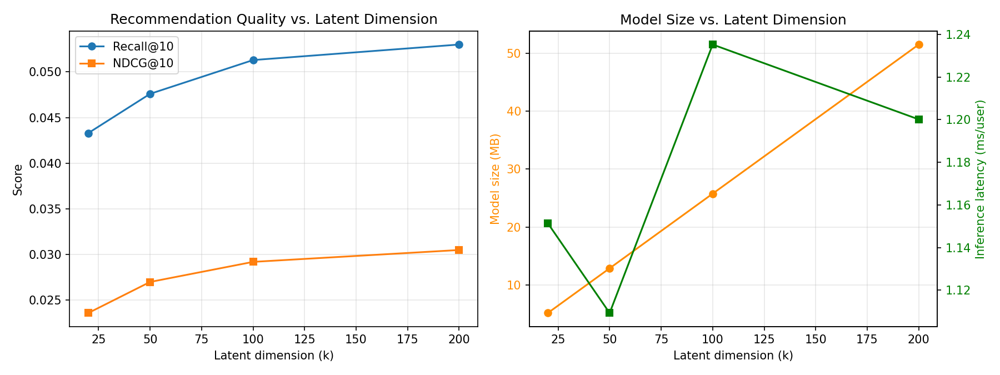

# Latent-Factor Collaborative Filtering for Video Game Recommendation

A research-oriented top-K recommendation system built on the Amazon Reviews 2018
(Video Games, 5-core) dataset. Central research question: **how does latent
dimensionality affect recommendation quality and computational efficiency in a
sparse user-item recommendation system?**

Live components: FastAPI recommendation service + Streamlit demo frontend.
See [Deployment](#deployment--live-demo) for how to run or host both.

---

## 1. Problem Formulation

Given a user's historical interactions, rank unseen video games by predicted
preference and return the top-K recommendations. Interactions are treated as
implicit feedback (observed = positive signal); ratings are available in the
data but are not the primary target.

## 2. Dataset & Preprocessing

- **Source:** Amazon Reviews 2018, Video Games category, official 5-core file
  (`Video_Games_5.json.gz`), 497,577 raw reviews.
- **Data-quality finding:** the raw file contained 23,937 duplicate
  `(user_id, item_id)` pairs (mostly exact re-submitted reviews; 133 pairs had
  differing ratings, 389 had differing timestamps). Because the published
  "5-core" guarantee was computed *before* this duplication, deduplicating
  breaks the guarantee for a subset of users/items.
- **Fix:** deduplicated (kept the most recent interaction per user-item pair),
  then applied **iterative k-core filtering** (drop users/items below 5
  interactions, repeat until stable) to produce a matrix that is genuinely
  5-core, not just nominally so.
- **Result:** 453,881 interactions · 50,626 users · 16,863 items · verified
  min. 5 interactions per user and per item.
- **Split:** temporal leave-last-out per user — most recent interaction →
  test, second-most-recent → validation, remainder → train. Zero val/test
  users are missing from train. 151 test interactions (0.30%) involve items
  never seen in train (cold-start items).

Scripts: `notebooks/01_load_and_eda.py`, `notebooks/02_preprocess.py`.

## 3. System Architecture

```
RAW REVIEWS (json.gz)
   -> dedup + iterative k-core filter
   -> temporal train/val/test split
   -> sparse user-item matrix (SciPy CSR)
   -> Truncated SVD (matrix factorization)
   -> top-K scoring (exclude seen items)
   -> serialized artifact (U, Vt, ID mappings)
   -> FastAPI  GET /recommend/{user_id}
   -> Streamlit demo UI
```

| Layer | Technology |
|---|---|
| Data / experiments | Python, Pandas, NumPy, SciPy |
| Core model | scikit-learn `TruncatedSVD` |
| Evaluation | Custom Recall@K / NDCG@K implementation |
| Backend | FastAPI + Uvicorn |
| Frontend | Streamlit |
| Storage | Parquet (interactions), Pickle (model artifacts) |

## 4. Baseline Models

| Model | Test Recall@10 | Test NDCG@10 |
|---|---|---|
| **E0 — Popularity** | 1.04% | 0.54% |
| **E1 — Item-based CF** (cosine similarity) | 6.46% | 3.72% |

Item-CF substantially outperforms popularity, giving a real bar for the core
model to clear.

## 5. Core Model — Truncated SVD

The sparse user-item matrix `R` (50,626 × 16,863, density ≈ 0.05%) is
factorized as `R ≈ U Σ Vᵀ`. Truncated SVD produces dense latent vectors per
user and per item; unseen-item scores are computed as `U[user] @ Vt` and
already-interacted (train) items are masked out before ranking.

## 6. Main Experiment — Latent-Dimension Ablation

k was swept across {20, 50, 100, 200} and evaluated on the held-out test set.

| k | Test Recall@10 | Test NDCG@10 | Model size (MB) | Latency (ms/user) |
|---|---|---|---|---|
| 20 | 4.33% | 2.36% | 5.2 | 1.15 |
| 50 | 4.76% | 2.70% | 12.9 | 1.11 |
| 100 | 5.13% | 2.92% | 25.8 | 1.24 |
| **200** | **5.30%** | **3.05%** | 51.5 | 1.20 |



**Finding:** quality improves monotonically with k but with clearly
diminishing returns (largest jump is k=20→50; k=100→200 gains far less per
added dimension), while model size grows roughly linearly and inference
latency stays flat (SVD scoring is a single matrix-vector product regardless
of k, in this range). **k = 200 was selected** as the best quality/efficiency
trade-off available within the tested range — the marginal size cost (51MB)
is still small enough to serve cheaply.

**Honest caveat:** at every tested k, plain (unweighted) Truncated SVD is
*outperformed* by the simpler item-CF baseline (Recall@10: 5.30% vs. 6.46%).
This is a legitimate empirical result, not a failed experiment — it reflects
that unweighted SVD on binary implicit feedback lacks the confidence
weighting that makes matrix factorization competitive in practice (see
Limitations). The ablation still answers the stated research question: it
quantifies the dimensionality/quality/cost trade-off precisely, which was the
goal, independent of whether SVD ultimately beats every baseline.

## 7. Error Analysis (k = 200 model, test set)

| Segment | n | Recall@10 |
|---|---|---|
| Overall | 50,626 | 5.30% |
| Cold-start items | 151 | 0.00% |
| Warm items | 50,475 | 5.32% |
| Sparse users (≤3 train interactions) | 15,963 | 6.18% |
| Active users (>3 train interactions) | 34,663 | 4.90% |
| Popular items | 41,007 | 6.55% |
| **Long-tail items** | **9,619** | **0.00%** |

**Key finding:** the model achieves **0% recall on long-tail items** and on
cold-start items. This is the classic popularity-bias failure mode of
unweighted SVD on implicit data — the top singular vectors are dominated by
high-degree (popular) items, so the model essentially never surfaces niche
items even when they are the correct answer. Sparse users are (counter-
intuitively) recommended to slightly *more* accurately than active users,
likely because sparse users' single train interactions correlate more
strongly with popular titles.

Script: `notebooks/07_error_analysis.py`.

## 8. Model Serialization & Serving

The k=200 model is serialized as a single artifact (`models/serving_artifact.pkl`)
containing the latent factors, ID mappings, and the sparse train matrix
(for seen-item filtering). The FastAPI service loads this once at startup.

```
GET /recommend/{user_id}?top_k=10
  -> map external user_id to matrix index
  -> score = U[user] @ Vt
  -> mask items already seen in train
  -> return top-K (item_id, score) pairs
```

Verified locally: `/health`, `/users/sample`, `/recommend/{user_id}` (200 and
404 paths) all tested end-to-end.

## 9. Deployment / Live Demo

This project's backend (FastAPI) and frontend (Streamlit) were built and
tested locally in this environment; they were **not deployed to a public host
from here**, since this sandbox only has network access to package registries
(PyPI/npm/GitHub), not hosting platforms like Render or Streamlit Community
Cloud. Both apps are deploy-ready — to put them live:

1. **Backend → Render or Railway:** push `backend/` as its own service.
   Start command: `uvicorn main:app --host 0.0.0.0 --port $PORT`.
2. **Frontend → Streamlit Community Cloud or Vercel:** push `frontend/`,
   point `API_URL` (sidebar input, or hardcode) at the deployed backend URL.
3. Add the resulting live links + a screenshot/GIF to this README.

## 10. Limitations & Future Work

- Plain Truncated SVD on unweighted binary data underperforms item-CF here;
  a weighted/implicit-ALS formulation (confidence weighting for repeat
  interactions) is likely to close or reverse this gap — natural next step.
- Severe popularity bias: 0% recall on long-tail and cold-start items.
  Mitigations to explore: hybrid popularity fallback for cold-start users/
  items, re-ranking with a diversity penalty, or content-based features for
  items with no interaction history.
- Evaluation uses leave-last-out with a single held-out item per user, the
  standard protocol for this setting but a stricter test than an average
  offline metric — absolute Recall@K values are expected to look low.
- Out of scope for this project (explicitly, not by omission): contextual
  bandits, reinforcement learning, causal inference, GRU/Transformer
  sequence models, and LLM-based explanation layers.

## 11. Reproducibility

```bash
# 1. Data prep
python notebooks/01_load_and_eda.py
python notebooks/02_preprocess.py

# 2. Baselines
python notebooks/03_popularity_baseline.py
python notebooks/04_itemcf_baseline.py

# 3. Core model + ablation
python notebooks/06_ablation.py

# 4. Error analysis
python notebooks/07_error_analysis.py

# 5. Serialize for serving
python notebooks/08_serialize.py

# 6. Run backend
cd backend && pip install -r requirements.txt && uvicorn main:app --reload

# 7. Run frontend (separate terminal)
cd frontend && pip install -r requirements.txt && streamlit run app.py
```

## 12. Repository Structure

```
data/            train/val/test/full parquet files
models/          serving_artifact.pkl (k=200 model + ID mappings)
notebooks/       numbered pipeline scripts (01-08)
backend/         FastAPI service
frontend/        Streamlit demo
results/         metrics CSVs + ablation plot
README.md        this file
```

Note: per-k ablation model checkpoints (k=20/50/100/200) are not committed to
keep the repo lean — they are fully reproducible by re-running
`notebooks/06_ablation.py`, which regenerates `results/results_svd_ablation.csv`
and the ablation plot.

## 13. What This Project Demonstrates (Interview-Ready)

- **Why SVD?** Compresses a high-dimensional sparse interaction matrix into
  compact latent factors that generalize beyond exact co-occurrence.
- **Why the ablation?** Turns "SVD avoids the curse of dimensionality" from
  an assumption into a measured trade-off curve (Section 6).
- **Why Recall@K / NDCG@K, not accuracy?** The system cares about ranking
  the few best items, not binary classification correctness.
- **Why report that SVD loses to item-CF?** Because every claim here is
  something I can defend with a number, not an assumption. Reporting the
  honest result — including where the "sophisticated" model underperforms
  the simple one — is itself the point of running baselines at all.
